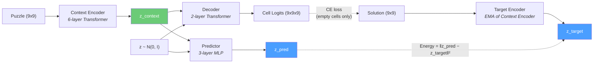
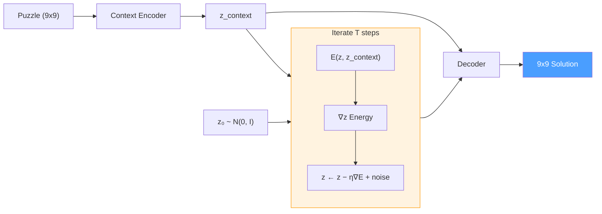

# Enso

An open-source replication of [Logical Intelligence's Kona 1.0](https://sudoku.logicalintelligence.com/) — an Energy-Based Model that solves Sudoku through latent reasoning. Kona achieved [96.2% accuracy on hard Sudoku](https://logicalintelligence.com/blog/energy-based-model-sudoku-demo) in ~313ms per puzzle, while frontier LLMs (GPT-5.2, Claude Opus 4.5, Gemini 3 Pro, DeepSeek V3.2) managed just 2% combined. This project implements the core idea: learn an energy landscape in representation space where valid solutions have low energy, then "think" at inference time by optimizing a latent variable via Langevin dynamics.

## Motivation

The [96% vs 2% gap](https://logicalintelligence.com/blog/energy-based-model-sudoku-demo) between EBMs and LLMs on Sudoku isn't about Sudoku specifically — it exposes a fundamental architectural limitation. LLMs generate solutions token-by-token, committing to each digit as they go, with no way to revise earlier decisions when conflicts emerge later. EBMs instead produce a complete candidate solution and evaluate it against all constraints simultaneously, using gradient information in continuous latent space to move toward valid configurations.

[Logical Intelligence](https://logicalintelligence.com/) (with Yann LeCun as founding chair of the Technical Research Board, Fields Medalist Michael Freedman as Chief of Mathematics) demonstrated this with Kona 1.0 — trained only on partial solutions (50% masked), it learned the rules and generated full solutions at test time.

This project is an independent replication using a JEPA (Joint Embedding Predictive Architecture) approach, informed by:
- [I-JEPA](https://arxiv.org/abs/2301.08243) (CVPR 2023) — Self-supervised learning through prediction in representation space
- [IRED](https://arxiv.org/abs/2401.02361) (2024) — Iterative reasoning with energy diffusion
- [JEPA-Reasoner](https://arxiv.org/abs/2502.07253) (2025) — Applying JEPA to logical reasoning tasks

## Architecture

### Training



### Inference (Langevin Dynamics)



### Components

| Module | Description | Parameters |
|--------|-------------|------------|
| **Context Encoder** | 6-layer Transformer with Sudoku-aware positional encoding (learned row + column + box embeddings). Encodes puzzle to z_context. | d_model=256, 8 heads |
| **Target Encoder** | Same architecture, processes solutions. Updated via EMA from context encoder (no gradients). | EMA momentum 0.996 -> 1.0 |
| **Predictor** | 3-layer MLP mapping (z_context, z) -> z_pred. Intentionally limited capacity so it can't ignore z. | hidden=512 |
| **Decoder** | 2-layer lightweight Transformer decoding (z_context, z) to per-cell digit logits. Hard-enforces given clues. | 4 heads, d_cell=64 |
| **Total** | ~7.4M trainable parameters | |

### Loss Function

$$\mathcal{L}_{\text{total}} = \mathcal{L}_{\text{energy}} + \mathcal{L}_{\text{VICReg}} + \mathcal{L}_{\text{decode}}$$

| Term | Formula | Purpose |
|------|---------|---------|
| $\mathcal{L}_{\text{energy}}$ | $\|\|z_{\text{pred}} - z_{\text{target}}\|\|^2$ | Drives representation learning |
| $\mathcal{L}_{\text{VICReg}}$ | Variance + covariance penalty on $z_{\text{context}}$ | Prevents representation collapse |
| $\mathcal{L}_{\text{decode}}$ | Cross-entropy on empty cells only | Auxiliary decoder supervision |

### Inference

At inference time, the model solves puzzles through Langevin dynamics — gradient-based optimization of the latent variable z:

1. Initialize multiple z chains from N(0, I)
2. For each step, compute energy = latent_energy + constraint_penalty
3. Update z via gradient descent with noise (temperature annealing)
4. Select the lowest-energy chain and decode to a discrete grid

## Project Structure

```
src/ebm/
    dataset/
        loader.py           # Kaggle dataset download and loading
        torch_dataset.py    # PyTorch Dataset with one-hot encoding
        splits.py           # Deterministic train/val/test splitting
    model/
        encoder.py          # SudokuEncoder (Transformer + positional encoding)
        predictor.py        # LatentPredictor (MLP)
        decoder.py          # SudokuDecoder (lightweight Transformer)
        energy.py           # Energy function (L2 distance)
        constraints.py      # Differentiable Sudoku constraint penalty
        jepa.py             # SudokuJEPA orchestrator
    training/
        trainer.py          # Training loop with validation
        losses.py           # VICReg + combined loss computation
        checkpoint.py       # Best-K checkpoint management
        scheduler.py        # LR warmup + cosine decay, EMA scheduling
        metrics.py          # Weights & Biases integration
    evaluation/
        solver.py           # Langevin dynamics inference
        metrics.py          # Cell accuracy, puzzle accuracy, constraint satisfaction
    utils/
        config.py           # Pydantic configuration classes
    main.py                 # CLI entry point
tests/                      # Unit tests (81 tests, 96%+ coverage)
scripts/
    smoke_test.py           # Quick training validation script
```

## Setup

Requires Python 3.13+ and [uv](https://docs.astral.sh/uv/).

```bash
# Clone and install
git clone https://github.com/MVPandey/Enso.git
cd Enso
uv sync

# Configure API keys (copy and fill in)
cp .env.example .env
```

Required `.env` variables:
- `KAGGLE_API_TOKEN` — for downloading the [9M Sudoku dataset](https://www.kaggle.com/datasets/rohanrao/sudoku)
- `WANDB_API_KEY` — for experiment tracking (optional)
- `WANDB_PROJECT`, `WANDB_ENTITY` — W&B project settings (optional)

## Usage

### Training

```bash
# Full training (9M puzzles, 50 epochs, ~20 hours on RTX 5090)
uv run python -m ebm.main train

# Quick experiment (100K puzzles, 20 epochs, ~5 minutes)
uv run python -m ebm.main train --n-samples 100000 --epochs 20

# Custom batch size
uv run python -m ebm.main train --batch-size 256 --epochs 10
```

### Evaluation

```bash
# Evaluate a trained checkpoint
uv run python -m ebm.main eval --checkpoint checkpoints/best.pt

# With custom inference parameters
uv run python -m ebm.main eval --checkpoint checkpoints/best.pt \
    --langevin-steps 100 --n-chains 16
```

### Smoke Test

```bash
# Verify training pipeline works (100 steps on 10K samples)
uv run python scripts/smoke_test.py
```

## Development

```bash
# Run tests
uv run pytest

# Lint and format
uv run ruff check --fix .
uv run ruff format .

# Type check
uv run ty check src/
```

## Dataset

Uses the [9 Million Sudoku Puzzles and Solutions](https://www.kaggle.com/datasets/rohanrao/sudoku) dataset from Kaggle. Each puzzle is an 81-character string of digits (0 = empty cell). The dataset is automatically downloaded and cached on first use.

- **Training**: 8M puzzles
- **Validation**: 500K puzzles
- **Test**: 500K puzzles

## Experiment Tracking

Training metrics are logged to [Weights & Biases](https://wandb.ai) when configured:

- Per-step: total loss, energy loss, VICReg loss, decode loss, learning rate, EMA momentum
- Per-epoch: validation energy, cell accuracy, puzzle accuracy, z-variance (collapse detector)

Runs are automatically named with timestamps for easy identification.

See [training-log.md](training-log.md) for detailed run history and findings.

## References

- [Kona 1.0 Sudoku Demo](https://sudoku.logicalintelligence.com/) — Logical Intelligence's EBM achieving 96.2% on hard Sudoku
- [EBM vs. LLMs: 96% vs. 2% Benchmark](https://logicalintelligence.com/blog/energy-based-model-sudoku-demo) — Technical blog post
- [I-JEPA](https://arxiv.org/abs/2301.08243) — Self-supervised learning through prediction in representation space
- [IRED](https://arxiv.org/abs/2401.02361) — Iterative reasoning with energy diffusion
- [JEPA-Reasoner](https://arxiv.org/abs/2502.07253) — Applying JEPA to logical reasoning tasks
