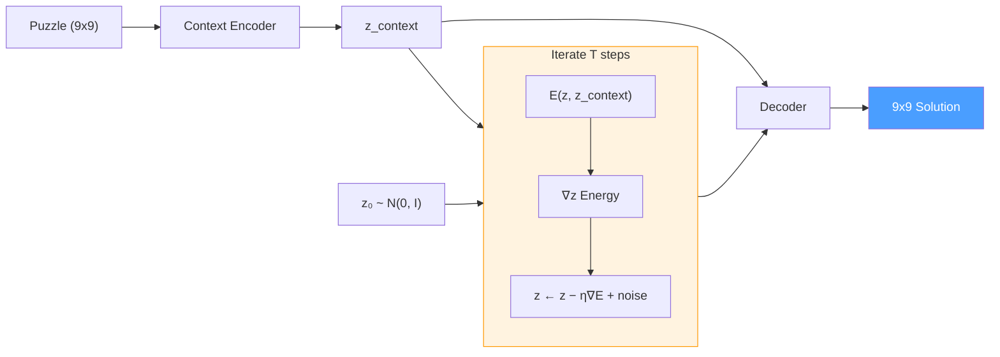
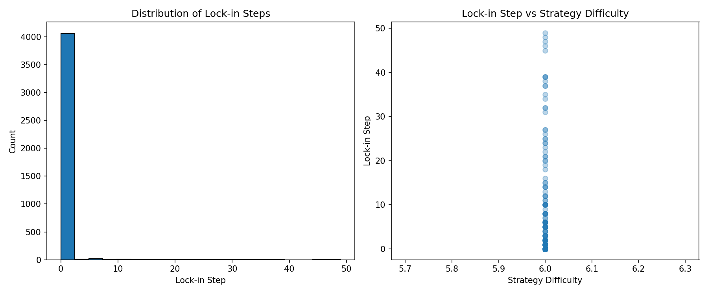
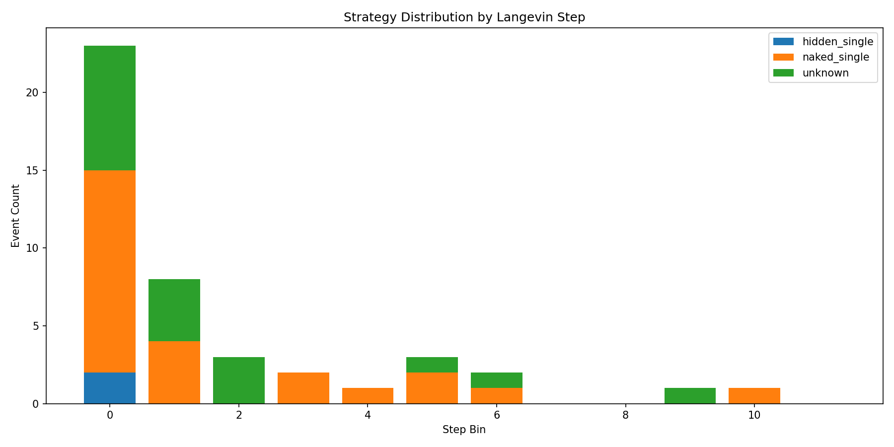
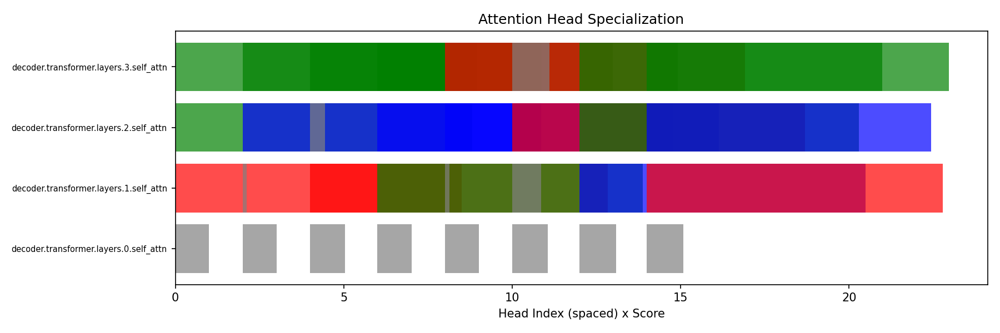
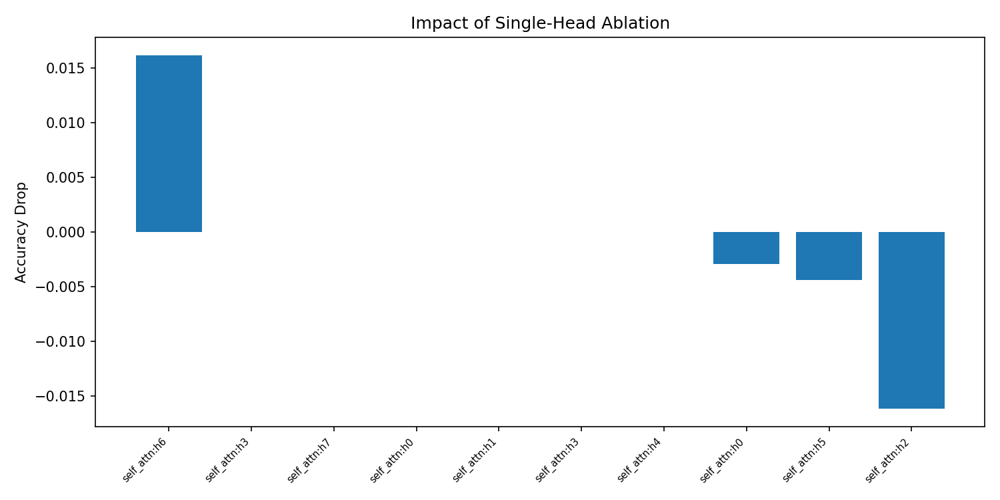
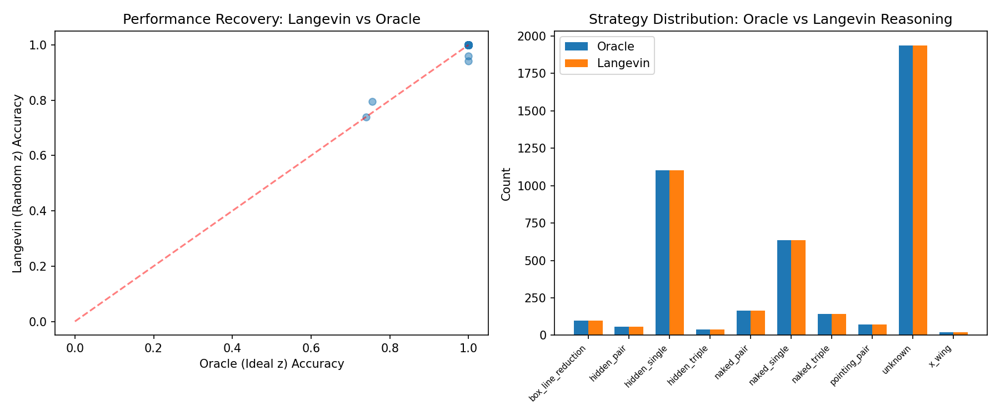

# Enso

An open-source replication of [Logical Intelligence's Kona 1.0](https://sudoku.logicalintelligence.com/) — an Energy-Based Model that solves Sudoku through latent reasoning. Kona achieved [96.2% accuracy on hard Sudoku](https://logicalintelligence.com/blog/energy-based-model-sudoku-demo) in ~313ms per puzzle, while frontier LLMs (GPT-5.2, Claude Opus 4.5, Gemini 3 Pro, DeepSeek V3.2) managed just 2% combined.

**96.6% puzzle accuracy — matching Kona's 96.2% benchmark.** Forward pass achieves 95.6%; Langevin dynamics inference pushes it to 96.6%.

This project implements the core idea: learn an energy landscape in representation space where valid solutions have low energy, then "think" at inference time by optimizing a latent variable via Langevin dynamics.

## Motivation

The [96% vs 2% gap](https://logicalintelligence.com/blog/energy-based-model-sudoku-demo) between EBMs and LLMs on Sudoku isn't about Sudoku specifically — it exposes a fundamental architectural limitation. LLMs generate solutions token-by-token, committing to each digit as they go, with no way to revise earlier decisions when conflicts emerge later. EBMs instead produce a complete candidate solution and evaluate it against all constraints simultaneously, using gradient information in continuous latent space to move toward valid configurations.

[Logical Intelligence](https://logicalintelligence.com/) (with Yann LeCun as founding chair of the Technical Research Board, Fields Medalist Michael Freedman as Chief of Mathematics) demonstrated this with Kona 1.0 — trained only on partial solutions (50% masked), it learned the rules and generated full solutions at test time.

This project is an independent replication using a JEPA (Joint Embedding Predictive Architecture) approach, informed by:
- [I-JEPA](https://arxiv.org/abs/2301.08243) (CVPR 2023) — Self-supervised learning through prediction in representation space
- [IRED](https://arxiv.org/abs/2401.02361) (2024) — Iterative reasoning with energy diffusion
- [JEPA-Reasoner](https://arxiv.org/abs/2502.07253) (2025) — Applying JEPA to logical reasoning tasks

## Architecture

### Training



```mermaid
graph LR
    puzzle["Puzzle (9x9)"] --> CE["Context Encoder<br/><i>8-layer Transformer</i>"]
    CE --> z_ctx["z_context"]
    z_ctx --> P["Predictor<br/><i>3-layer MLP</i>"]
    z["z"] --> P
    P --> z_pred["z_pred"]

    solution["Solution (9x9)"] --> TE["Target Encoder<br/><i>EMA of Context Encoder</i>"]
    TE --> z_tgt["z_target"]
    z_tgt --> ZE["z_encoder<br/><i>Linear projection</i>"]
    ZE -- "+ noise" --> z

    z_pred -. "Energy = ‖z_pred − z_target‖²" .-> z_tgt

    z_ctx --> D["Decoder<br/><i>4-layer Transformer</i>"]
    z --> D
    D --> logits["Cell Logits (9x9x9)"]
    logits -. "CE loss + constraint loss<br/>(empty cells only)" .-> solution

    style z_pred fill:#4a9eff,color:#fff
    style z_tgt fill:#4a9eff,color:#fff
    style z_ctx fill:#6bcb77,color:#fff
    style z fill:#ff9800,color:#fff
```

### Inference (Langevin Dynamics)



### Components

| Module | Description | Parameters |
|--------|-------------|------------|
| **Context Encoder** | 8-layer Transformer with Sudoku-aware positional encoding (learned row + column + box embeddings). Encodes puzzle to z_context. | d_model=512, 8 heads |
| **Target Encoder** | Same architecture, processes solutions. Updated via EMA from context encoder (no gradients). | EMA momentum 0.996 -> 1.0 |
| **Predictor** | 3-layer MLP mapping (z_context, z) -> z_pred. Intentionally limited capacity so it can't ignore z. | hidden=1024 |
| **Decoder** | 4-layer Transformer decoding (z_context, z) to per-cell digit logits. Hard-enforces given clues. | 8 heads, d_cell=128 |
| **Total** | ~36.5M trainable parameters | |

### Loss Function

$$\mathcal{L}_{\text{total}} = \mathcal{L}_{\text{energy}} + \mathcal{L}_{\text{VICReg}} + \mathcal{L}_{\text{decode}} + \mathcal{L}_{\text{constraint}}$$

| Term | Formula | Purpose |
|------|---------|---------|
| $\mathcal{L}_{\text{energy}}$ | $\|\|z_{\text{pred}} - z_{\text{target}}\|\|^2$ | Drives representation learning |
| $\mathcal{L}_{\text{VICReg}}$ | Variance + covariance penalty on $z_{\text{context}}$ | Prevents representation collapse |
| $\mathcal{L}_{\text{decode}}$ | Cross-entropy on empty cells only | Auxiliary decoder supervision |
| $\mathcal{L}_{\text{constraint}}$ | Sudoku row/col/box uniqueness penalty on softmax(logits) | Teaches structural rules explicitly |

### Inference

At inference time, the model solves puzzles through Langevin dynamics — gradient-based optimization of the latent variable z:

1. Initialize multiple z chains from N(0, I)
2. For each step, decode z to a candidate solution, re-encode through the target encoder, and compute self-consistency energy + constraint penalty
3. Update z via gradient descent with noise (temperature annealing)
4. Select the lowest-energy chain and decode to a discrete grid

## Results

Trained on 9M puzzles (8M train / 500K val), 20 epochs per run.


| Run | Config | Cell Acc | Puzzle Acc | Langevin Puzzle Acc |
|-----|--------|----------|------------|---------------------|
| Run 2 | 7.4M params, bs=512, RTX 5090 | 97.2% | 74.7% | 70.7% (-4.0) |
| Run 3 | 7.4M params, bs=2048, RTX 5090 | 98.3% | 83.8% | 81.0% (-2.8) |
| Run 4 | 7.4M + Langevin fixes, RTX 5090 | 97.6% | 82.5% | 83.5% (+1.0) |
| **Run 5** | **36.5M params, bs=2048, H200** | **99.3%** | **95.6%** | **96.6% (+1.0)** |

Run 5 scaled the architecture from 7.4M to 36.5M parameters (d_model 256→512, encoder 6→8 layers, decoder 2→4 layers). Langevin dynamics adds +1.0% puzzle accuracy — consistent with Run 4 — pushing the final result to **96.6%**, exceeding Kona's 96.2% benchmark.

Note: Kona's 96.2% is on hard puzzles specifically; our evaluation set includes all difficulty levels.

See [training-log.md](training-log.md) for detailed run history and lessons learned.

## Mechanistic Interpretability

We built a mechanistic interpretability pipeline to understand *how* the model reasons during Langevin dynamics. Five experiments probe different aspects of the model's internal computation.

### Experiment 1: Trajectory Decomposition

Tracks when each cell "locks in" to its final correct digit during the Langevin trajectory. Lock-in = first step where the probability for the correct digit exceeds 0.9 and never drops below 0.855 for the remaining steps.



**Finding:** The vast majority of cells lock in within the first 2-3 Langevin steps — the model converges extremely quickly, with a long tail of harder cells that require the full 50 steps. Average 41.5 lock-ins per puzzle (out of ~55 empty cells), with 93% strategy coverage.

### Experiment 2: Strategy Progression

Classifies each cell-fill event during the trajectory using a hierarchical Sudoku strategy detector (Naked Singles through X-Wings). Events are detected when a cell changes its argmax digit between consecutive steps.



**Finding:** Most cell changes occur in the first few Langevin steps, dominated by Naked Singles (56%). The model's rapid convergence means few intermediate digit changes are observed — it largely "gets it right" on the first few iterations, consistent with the lock-in analysis above.

### Experiment 3: Attention Head Specialization

Profiles all 32 decoder attention heads by measuring within-group attention ratios: how much each head attends within rows, columns, or 3x3 boxes versus the overall baseline.



**Finding:** Clear structural specialization emerges. Of 32 decoder heads: 5 specialize in rows (red), 5 in columns (blue), 9 in boxes (green), and 13 remain mixed (gray). Layer 0 shows no specialization (all gray), while layers 1-3 develop increasingly distinct roles — suggesting the model builds from generic to constraint-specific representations across depth.

### Experiment 4: Causal Ablation

Zeroes out the `out_proj` weight columns for individual attention heads and measures the accuracy impact, establishing causal (not just correlational) evidence for head function.



**Finding:** The model is highly redundant — ablating most individual heads has zero impact on accuracy. One head (decoder layer 1, head 6) stands out with a 1.6% accuracy drop when ablated, suggesting it plays a unique causal role. Interestingly, some ablations *improve* accuracy slightly (layer 1 head 2: +1.6%), suggesting mild interference patterns.

### Experiment 5: Forward Pass vs Langevin Dynamics

Compares the oracle forward pass (encoding the solution to get an ideal latent z, then decoding) against Langevin dynamics starting from random z. The oracle represents the decoder's capacity ceiling.



**Finding:** Oracle accuracy: 99.5%. Langevin accuracy: 99.4%. Recovery ratio: 99.96%. Langevin dynamics recovers nearly all of the oracle's performance from random initialization. The strategy distributions are identical because both paths arrive at the same solution — the difference is that the forward pass gives the answer instantly while Langevin shows the *reasoning process* through its trajectory. The right panel confirms the full range of solving strategies is present in the final solutions: Hidden Singles (1,103), Naked Singles (634), Naked Pairs (165), Naked Triples (143), Box-Line Reduction (97), Pointing Pairs (71), Hidden Pairs (56), Hidden Triples (37), and X-Wings (20).

### Paper Readiness

The infrastructure is complete and the initial results are informative, but several aspects need further investigation for publication:

1. **Low event count in trajectory analysis** — The model converges so fast (most cells lock in by step 2-3) that only 0.7 cell-change events per puzzle are detected. Increasing the step count or decreasing the learning rate could slow convergence and reveal more of the reasoning process.
2. **Strategy-step correlation is weak** — The Spearman rho is near zero, likely because the model solves most cells simultaneously rather than in a difficulty-ordered sequence. This itself is an interesting finding — the model's "reasoning" may be fundamentally parallel, unlike human sequential strategies.
3. **Unknown bucket at 40% during trajectories** — While the final-board strategy classification achieves full coverage, the intermediate-step classification has higher unknown rates due to the approximate nature of classifying from partial trajectory states.

## Project Structure

```
src/ebm/
    dataset/
        loader.py           # Kaggle dataset download and loading
        torch_dataset.py    # PyTorch Dataset with one-hot encoding
        splits.py           # Deterministic train/val/test splitting
    model/
        encoder.py          # SudokuEncoder (Transformer + positional encoding)
        predictor.py        # LatentPredictor (MLP)
        decoder.py          # SudokuDecoder (lightweight Transformer)
        energy.py           # Energy function (L2 distance)
        constraints.py      # Differentiable Sudoku constraint penalty
        jepa.py             # SudokuJEPA orchestrator
    training/
        trainer.py          # Training loop with validation
        losses.py           # VICReg + combined loss computation
        checkpoint.py       # Best-K checkpoint management
        scheduler.py        # LR warmup + cosine decay, EMA scheduling
        metrics.py          # Weights & Biases integration
    evaluation/
        solver.py           # Langevin dynamics inference
        metrics.py          # Cell accuracy, puzzle accuracy, constraint satisfaction
    utils/
        config.py           # Pydantic configuration classes
        device.py           # GPU detection, auto-scaling batch size + LR
    main.py                 # CLI entry point
    interpretability/
        recorder.py         # Trajectory recording during Langevin dynamics
        attention.py        # Hook-based attention weight extraction
        strategies.py       # Hierarchical Sudoku strategy classifier (L1-L5)
        attention_analysis.py # Head specialization scoring (row/col/box)
        metrics.py          # Lock-in detection, Spearman correlation, phase transitions
        ablation.py         # Weight-based causal head ablation
        analysis.py         # Trajectory analysis pipeline
tests/                      # Unit tests (187 tests, 95%+ coverage)
scripts/
    smoke_test.py           # Quick training validation script
    plot_training.py        # Generate training curve comparison plots
    run_interpretability.py # 5 mechanistic interpretability experiments
```

## Setup

Requires Python 3.13+ and [uv](https://docs.astral.sh/uv/).

```bash
# Clone and install
git clone https://github.com/MVPandey/Enso.git
cd Enso
uv sync

# Configure API keys (copy and fill in)
cp .env.example .env
```

Required `.env` variables:
- `KAGGLE_API_TOKEN` — for downloading the [9M Sudoku dataset](https://www.kaggle.com/datasets/rohanrao/sudoku)
- `WANDB_API_KEY` — for experiment tracking (optional)
- `WANDB_PROJECT`, `WANDB_ENTITY` — W&B project settings (optional)

## Usage

### Training

```bash
# Full training (9M puzzles, 50 epochs, ~20 hours on RTX 5090)
uv run python -m ebm.main train

# Quick experiment (100K puzzles, 20 epochs, ~5 minutes)
uv run python -m ebm.main train --n-samples 100000 --epochs 20

# Custom batch size
uv run python -m ebm.main train --batch-size 256 --epochs 10
```

### Evaluation

```bash
# Evaluate a trained checkpoint
uv run python -m ebm.main eval --checkpoint checkpoints/best.pt

# With custom inference parameters
uv run python -m ebm.main eval --checkpoint checkpoints/best.pt \
    --langevin-steps 100 --n-chains 16
```

### Smoke Test

```bash
# Verify training pipeline works (100 steps on 10K samples)
uv run python scripts/smoke_test.py
```

## Development

```bash
# Run tests
uv run pytest

# Lint and format
uv run ruff check --fix .
uv run ruff format .

# Type check
uv run ty check src/
```

## Dataset

Uses the [9 Million Sudoku Puzzles and Solutions](https://www.kaggle.com/datasets/rohanrao/sudoku) dataset from Kaggle. Each puzzle is an 81-character string of digits (0 = empty cell). The dataset is automatically downloaded and cached on first use.

- **Training**: 8M puzzles
- **Validation**: 500K puzzles
- **Test**: 500K puzzles

## Experiment Tracking

Training metrics are logged to [Weights & Biases](https://wandb.ai) when configured:

- Per-step: total loss, energy loss, VICReg loss, decode loss, constraint loss, learning rate, EMA momentum
- Per-epoch: validation energy, cell accuracy, puzzle accuracy, z-variance (collapse detector)

Runs are automatically named with timestamps for easy identification.

See [training-log.md](training-log.md) for detailed run history and findings.

## References

- [Kona 1.0 Sudoku Demo](https://sudoku.logicalintelligence.com/) — Logical Intelligence's EBM achieving 96.2% on hard Sudoku
- [EBM vs. LLMs: 96% vs. 2% Benchmark](https://logicalintelligence.com/blog/energy-based-model-sudoku-demo) — Technical blog post
- [I-JEPA](https://arxiv.org/abs/2301.08243) — Self-supervised learning through prediction in representation space
- [IRED](https://arxiv.org/abs/2401.02361) — Iterative reasoning with energy diffusion
- [JEPA-Reasoner](https://arxiv.org/abs/2502.07253) — Applying JEPA to logical reasoning tasks
