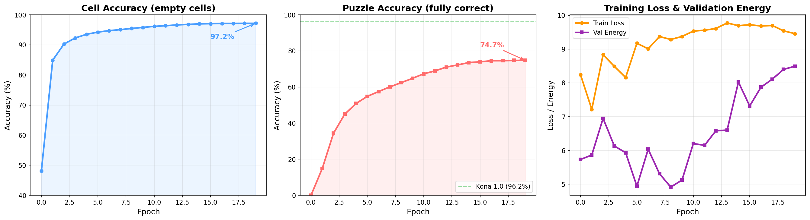

# Training Log

Documenting runs, bugs, and learnings as we iterate toward replicating [Kona 1.0's 96.2% accuracy](https://logicalintelligence.com/blog/energy-based-model-sudoku-demo).

---

## Run 1: MVP Validation (100K samples, 20 epochs)

**Date:** Feb 11, 2026
**Config:** 100K samples, batch_size=512, 20 epochs, lr=3e-4
**Hardware:** RTX 5090

### Bugs Found During This Run

Five critical bugs were found and fixed before meaningful training could begin.

**1. Solution tensor encoding mismatch**
Solution was stored as `(digit, row, col)` (channel-first), but `argmax(dim=-1)` took argmax along the column axis. This meant the model was training on scrambled targets. Fixed by switching to `(row, col, digit)` and adding `permute(0, 3, 1, 2)` before the target encoder.

**2. Decode loss included given cells**
Cross-entropy was computed over all 81 cells, but given cells had 1e6 logits from hard enforcement — near-zero loss. With ~40% of cells given, the average loss dropped from 2.2 to 1.25 purely from the easy population. Empty cells never learned. Fixed by masking to compute loss on empty cells only.

**3. VICReg applied to wrong tensor**
VICReg was applied to `z_pred` (predictor output), but this didn't prevent the context/target encoders from collapsing. The target encoder (EMA of context encoder) collapsed to a point, making energy trivially zero. Fixed by applying VICReg to `z_context` (context encoder output), which propagates to the target encoder via EMA.

**4. LR warmup exceeded total steps**
With 100K samples and 5 epochs: only 880 total steps, but warmup was set to 2000. LR never reached its peak, and `CosineAnnealingLR(T_max=-1120)` got a negative period. Fixed by capping warmup to `total_steps // 5`.

**5. Checkpoint metric was inverted**
Checkpoints saved models with lowest energy. But low energy = collapsed representations (z_pred trivially matching z_target when both map to the same point). Models with best cell accuracy had the highest energy and were never saved. Fixed by checkpointing on cell accuracy (higher = better).

### Results After Fixes

| Metric | Epoch 0 | Epoch 20 |
|--------|---------|----------|
| Cell accuracy | 11.1% (random) | 13.9% |
| z_variance | > 0 | > 0 (no collapse) |
| Energy loss | decreasing | stable gradient signal |
| Decode loss | decreasing | real signal from empty cells |

Key finding: 25% relative improvement over random, representations not collapsing. Limited by data (100K) and epochs (20).

### Hyperparameters That Worked

- `decode_loss_weight=1.0` (was 0.1 — too low, decoder had no influence)
- `vicreg_var_weight=1.0` (was 25.0 — dominated total loss)
- `vicreg_cov_weight=0.01` (was 1.0 — too aggressive)
- VICReg target: `z_context` (not `z_pred`)
- Checkpoint metric: `cell_accuracy` (not energy)

---

## Run 2: Full Scale (9M samples, 20 epochs)

**Date:** Feb 11-12, 2026
**Config:** 9M samples (8M train / 500K val), batch_size=512, 20 epochs, lr=3e-4
**Hardware:** RTX 5090
**Duration:** 7.5 hours (~22 min/epoch)

### Bug Fixed Before This Run

**6. Latent variable z was uninformative**
During training, z was sampled as pure random noise `N(0, I)`, uncorrelated with the solution. Both the predictor and decoder were trained to produce the same correct output regardless of z — so they learned to ignore it. At inference, Langevin dynamics optimized z via gradients, but since nothing had learned to use z, `dE/dz ≈ 0` and the optimization did nothing.

Fixed by adding a `z_encoder` (linear projection from d_model → d_latent). During training: `z = z_encoder(z_target) + noise`, so z carries noisy solution information. The predictor and decoder learn to use z meaningfully. At inference, z starts random and Langevin dynamics can now follow real gradients toward valid solutions.

### Results

| Epoch | Cell Acc | Puzzle Acc | Train Loss | Val Energy |
|-------|----------|------------|------------|------------|
| 0 | 48.2% | 0.0% | 8.24 | 5.73 |
| 1 | 84.9% | 14.8% | 7.22 | 5.87 |
| 2 | 90.3% | 34.4% | 8.83 | 6.95 |
| 5 | 94.2% | 54.8% | 9.17 | 4.94 |
| 10 | 96.2% | 67.3% | 9.53 | 6.20 |
| 15 | 97.0% | 73.9% | 9.72 | 7.32 |
| 19 | **97.2%** | **74.7%** | 9.46 | 8.49 |

### Observations

- Cell accuracy surpassed Kona's 96.2% benchmark by epoch 10 (though Kona's metric is on hard puzzles specifically)
- Puzzle accuracy plateaued around 74-75% in later epochs — diminishing returns on this learning rate schedule
- Val energy increased in later epochs while accuracy still improved — the model is learning more complex representations, not collapsing
- Forward-pass accuracy only; Langevin dynamics inference should improve puzzle accuracy further

### What Worked

- `z_encoder` fix was the key breakthrough: from 13.9% cell accuracy (Run 1) to 97.2%
- VICReg on z_context with var=1.0, cov=0.01 — prevents collapse without dominating the loss
- Decode loss weight=1.0 — gives the decoder enough gradient signal
- Cosine LR decay after warmup — smooth training progression

### Inference Evaluation

Ran the Langevin dynamics solver on 1K test puzzles (50 steps, 8 chains):

| Metric | Forward Pass | Langevin Solver |
|--------|-------------|-----------------|
| Cell accuracy | 97.2% | 96.5% |
| Puzzle accuracy | 74.7% | 70.7% |
| Constraint satisfaction | — | 92.9% |

The solver made things **worse**. Diagnostics revealed why:

**The decoder barely uses z.** `z_encoder(z_target)` has L2 norm ~144, but `noise_scale=1.0` adds noise with norm ~11. During training, z ≈ z_encoder(z_target) with <8% noise — the decoder learned z as a near-deterministic lookup of the solution, not a variable to reason over. It relies on z_context for ~96% cell accuracy and z for a marginal ~1% improvement.

**Langevin dynamics does nothing.** Over 50 steps, z_norm changed from 11.29 to 11.28. Gradient norm was ~0.52, so each step moved z by `lr * 0.52 = 0.005` — a 0.04% change. Cell accuracy was flat at 95.2% throughout. The solver can't improve solutions because the decoder is insensitive to z.

**Chain selection by energy hurts.** The 8 chains produce nearly identical outputs (since z barely matters), but chain selection uses `||z_pred||² + constraint_penalty`, which doesn't correlate well with actual accuracy. It occasionally picks a slightly worse chain.

### Next Steps

**Fix z_encoder magnitude (critical).** The root cause is z_encoder outputting high-norm vectors that drown out noise. L2-normalizing z_encoder output would force z_target_latent to unit norm, making noise_scale=1.0 actually corrupt ~50% of the signal. The decoder would have to genuinely use z while being robust to noise — exactly what Langevin dynamics needs.

**Learning rate tuning.** Accuracy plateaued after epoch 15 with cosine decay from 3e-4. A second training phase with lower LR (e.g. 1e-4 or 5e-5) could push past the plateau.

**More epochs.** 20 epochs may not be enough — the curve was still climbing (slowly) at epoch 19. Running 50 epochs at reduced LR could squeeze out a few more points.

**Difficulty-stratified evaluation.** Kona's 96.2% is specifically on hard puzzles. Our validation set is mixed difficulty. Need to stratify by number of given clues to get a fair comparison.

**Decoder capacity.** The decoder is a lightweight 2-layer Transformer. Trying 3-4 layers or larger d_cell could help, though this would slow inference.

---

## Run 3: Larger Batch + Scaled LR (9M samples, 20 epochs)

**Date:** Feb 14, 2026
**Config:** 9M samples (8M train / 500K val), batch_size=2048, 20 epochs, lr=6e-4
**Hardware:** RTX 5090
**Duration:** ~7 hours (~21 min/epoch)

### Changes for This Run

**Auto-scaling batch size and LR from GPU VRAM.** Added `auto_scale_config()` which detects available VRAM, selects the largest feasible batch size (capped at 2048), and scales the learning rate using the square-root rule: `lr = 3e-4 * sqrt(batch_size / 512)`. With batch_size=2048, this gives lr=6e-4.

**Best checkpoint auto-uploaded to W&B.** After training completes, the highest-accuracy checkpoint is uploaded as a W&B model artifact.

### Results

| Epoch | Cell Acc | Puzzle Acc | Train Loss | Val Energy |
|-------|----------|------------|------------|------------|
| 0 | 43.8% | 0.0% | 9.49 | 4.62 |
| 1 | 73.4% | 0.7% | 9.58 | 7.30 |
| 2 | 87.6% | 19.1% | 8.36 | 9.10 |
| 5 | 95.3% | 61.1% | 8.65 | 4.78 |
| 10 | 97.5% | 76.6% | 6.76 | 3.12 |
| 15 | 98.2% | 82.8% | 5.13 | 3.40 |
| 19 | **98.3%** | **83.8%** | 5.29 | 4.03 |

### Comparison with Run 2

| Metric | Run 2 (bs=512, lr=3e-4) | Run 3 (bs=2048, lr=6e-4) | Delta |
|--------|------------------------|--------------------------|-------|
| Cell accuracy | 97.2% | **98.3%** | +1.1% |
| Puzzle accuracy | 74.7% | **83.8%** | +9.1% |
| Train loss (final) | 9.46 | 5.29 | -4.17 |
| Val energy (final) | 8.49 | 4.03 | -4.46 |

The larger batch + sqrt-scaled LR significantly improved both metrics. Train loss and val energy both decreased substantially compared to Run 2, suggesting the model found a better optimum.

### Inference Evaluation

Ran Langevin dynamics on 500 test puzzles (100 steps, 16 chains):

| Metric | Forward Pass | Langevin Solver |
|--------|-------------|-----------------|
| Cell accuracy | 98.3% | 97.5% |
| Puzzle accuracy | 83.8% | 81.0% |
| Constraint satisfaction | — | 95.6% |

**Same pattern as Run 2 — Langevin dynamics makes things worse.** Constraint satisfaction improved (95.6% vs 92.9% in Run 2), showing the model's raw outputs are more structurally valid, but the solver still can't improve solutions.

### Root Cause Analysis: Why Langevin Dynamics Fails

Three structural issues identified across Runs 2 and 3:

**1. z_encoder magnitude makes z a lookup table.** `z_encoder(z_target)` has L2 norm ~144 while noise has norm ~11 (<8% of signal). The decoder learned z as a near-deterministic encoding of the answer, not a variable to reason over. Fix: L2-normalize z_encoder output to unit norm AND reduce `z_noise_scale` to 0.1, giving noise L2 ≈ 1.13 for ~1:1 SNR. (Note: normalizing alone with scale=1.0 would swing to the opposite extreme — noise L2 ≈ 11.3 vs signal 1.0, SNR 0.09:1 — and the model would learn to ignore z.)

**2. Inference energy is disconnected from training.** Training energy = `||z_pred - z_target||²` (meaningful). Inference uses `||z_pred||²` (assumes z_target ≈ 0, which is false). This provides misleading gradients that fight against the constraint penalty. Fix: self-consistency energy — decode the solution, re-encode through the target encoder, compare with z_pred: `||z_pred - target_encoder(decode(z))||²`.

**3. Model doesn't know Sudoku rules during training.** The constraint penalty is only used at inference. The model learns Sudoku implicitly via cross-entropy on correct cells but never sees explicit constraint signals. Adding a constraint loss during training teaches the decoder that outputs must satisfy row/column/box uniqueness.

### Changes Implemented for Next Run

1. **L2-normalize z_encoder output + rescale noise** — `F.normalize(self.z_encoder(z_target), dim=-1)` forces unit-norm z. Reduced `z_noise_scale` from 1.0 to 0.1 so noise L2 ≈ 1.13 (≈ `0.1 * √128`), giving ~1:1 SNR. Without this rescale, noise L2 ≈ 11.3 would drown out the unit-norm signal (SNR 0.09:1) and the model would learn to ignore z — the same failure from the opposite direction.
2. **Constraint loss during training** — `constraint_penalty(softmax(decode_logits)).mean()` added to total loss with weight 0.1
3. **Self-consistency inference energy** — replaced `||z_pred||²` with decode→re-encode cycle: `||z_pred - target_encoder(softmax(logits))||² + constraint_penalty`

---

## Key Lessons

### Representation collapse is the primary failure mode
Without VICReg on the right tensor, the encoder maps everything to a single point. Energy goes to zero (trivially correct), but nothing is learned. Monitor z_variance as a collapse detector.

### The latent variable must carry information during training — but not too much
Random z teaches the model to ignore z entirely. Making z a noisy projection of z_target means the predictor and decoder learn to use z. But if the projection has high magnitude and noise is relatively small, z becomes a near-deterministic lookup of the answer. The decoder still mostly ignores the z "variable" and just reads the z "code." The noise must meaningfully corrupt z so the model learns to reason with partial information, not just decode a lookup.

### Loss decomposition matters
A decreasing total loss can hide complete failure. The decode loss "improved" because given cells were trivially correct, masking the fact that empty cells learned nothing. Always decompose losses and check each component independently.

### Checkpoint what you care about
Checkpointing by energy (lower=better) accidentally saved collapsed models. The metric you checkpoint on must align with what you actually want to optimize.