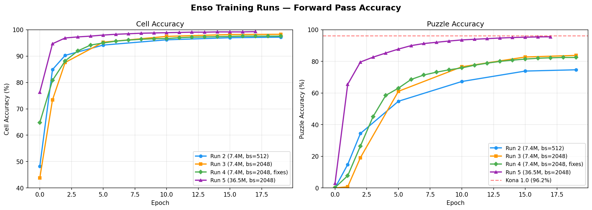

# Training Log

Documenting runs and learnings toward replicating [Kona 1.0's 96.2% accuracy](https://logicalintelligence.com/blog/energy-based-model-sudoku-demo).

---

## Run 1: MVP Validation (100K samples, 20 epochs)

**Date:** Feb 11 | **Hardware:** RTX 5090 | **Config:** 100K samples, bs=512, lr=3e-4

Five critical bugs fixed before meaningful training: (1) solution tensor encoding mismatch — `(digit, row, col)` vs `(row, col, digit)`; (2) decode loss included given cells, masking empty-cell failure; (3) VICReg applied to `z_pred` instead of `z_context`, allowing target encoder collapse; (4) LR warmup exceeded total steps; (5) checkpointing on lowest energy saved collapsed models.

**Result:** 13.9% cell accuracy (25% relative improvement over random 11.1%). Representations not collapsing. Limited by data and epochs.

---

## Run 2: Full Scale (9M samples, 20 epochs)

**Date:** Feb 11-12 | **Hardware:** RTX 5090 | **Config:** 9M samples, bs=512, lr=3e-4 | **Duration:** 7.5h

**Key fix:** Added `z_encoder` (linear projection from d_model to d_latent). Previously z was pure random noise — the model learned to ignore it entirely, making Langevin dynamics useless. Now `z = z_encoder(z_target) + noise`, so z carries noisy solution information.

| Epoch | Cell Acc | Puzzle Acc |
|-------|----------|------------|
| 0 | 48.2% | 0.0% |
| 5 | 94.2% | 54.8% |
| 10 | 96.2% | 67.3% |
| 19 | **97.2%** | **74.7%** |

**Langevin inference (1K puzzles, 50 steps, 8 chains):** 96.5% cell / 70.7% puzzle — solver made things **worse**. Root cause: z_encoder output had L2 norm ~144 vs noise norm ~11, making z a near-deterministic lookup. The decoder relied on z_context for ~96% accuracy and z for a marginal ~1%.

---

## Run 3: Larger Batch + Scaled LR (9M samples, 20 epochs)

**Date:** Feb 14 | **Hardware:** RTX 5090 | **Config:** 9M samples, bs=2048, lr=6e-4 | **Duration:** ~7h

**Changes:** Auto-scaling batch size and LR from GPU VRAM (sqrt rule: `lr = 3e-4 * sqrt(batch/512)`). Best checkpoint auto-uploaded to W&B.

| Epoch | Cell Acc | Puzzle Acc |
|-------|----------|------------|
| 0 | 43.8% | 0.0% |
| 5 | 95.3% | 61.1% |
| 10 | 97.5% | 76.6% |
| 19 | **98.3%** | **83.8%** |

**vs Run 2:** +1.1% cell, +9.1% puzzle. Larger batch + sqrt-scaled LR found a better optimum.

**Langevin inference (500 puzzles, 100 steps, 16 chains):** 97.5% cell / 81.0% puzzle — solver still made things worse. Same structural issues as Run 2.

### Root Cause Analysis: Why Langevin Dynamics Fails

1. **z_encoder magnitude makes z a lookup table.** L2 norm ~144 vs noise ~11 (SNR 13:1). Decoder treats z as a deterministic answer code, not a variable to reason over.
2. **Inference energy disconnected from training.** Training: `||z_pred - z_target||²`. Inference: `||z_pred||²` (assumes z_target ≈ 0, which is false). Misleading gradients.
3. **No Sudoku rules during training.** Constraint penalty only at inference. Model learns rules implicitly via cross-entropy but never sees explicit constraint signals.

---

## Run 4: Langevin Fixes (9M samples, 20 epochs)

**Date:** Feb 15 | **Hardware:** RTX 5090 | **Config:** 9M samples, bs=2048, lr=6e-4 | **Duration:** ~7h

**Three structural fixes:**
1. **L2-normalize z_encoder output** — forces unit-norm z before adding noise. Reduced `z_noise_scale` from 1.0 to 0.1 for ~1:1 SNR (noise L2 ≈ 1.13 vs signal 1.0).
2. **Constraint loss during training** — `constraint_penalty(softmax(logits))` added to loss (weight=0.1). Teaches Sudoku row/col/box rules explicitly.
3. **Self-consistency inference energy** — replaced `||z_pred||²` with decode → re-encode → compare: `||z_pred - target_encoder(decode(z))||²`.

| Epoch | Cell Acc | Puzzle Acc |
|-------|----------|------------|
| 0 | 64.8% | 0.2% |
| 5 | 95.0% | 63.1% |
| 10 | 96.7% | 75.9% |
| 19 | **97.6%** | **82.5%** |

**Langevin inference (1K puzzles, 100 steps, 8 chains):** 97.8% cell / **83.5%** puzzle — **solver improved results for the first time** (+1.0% puzzle accuracy). In Runs 2-3, it always decreased accuracy by 3-4 points. Constraint satisfaction: 96.2%.

**vs Run 3:** Forward pass slightly lower (97.6% vs 98.3% cell, 82.5% vs 83.8% puzzle), but Langevin now adds value instead of destroying it. The constraint loss trades some raw accuracy for structural correctness.

---

## Run 5: Scaled Architecture (9M samples, 20 epochs)

**Date:** Feb 15-16 | **Hardware:** H200 (144GB) | **Config:** 9M samples, bs=2048, lr=6e-4 | **Duration:** ~22h

**Changes:** Scaled architecture from 7.4M to 36.5M trainable parameters: d_model 256→512, encoder 6→8 layers, decoder 2→4 layers, d_latent 128→256, predictor hidden 512→1024, decoder d_cell 64→128.

| Epoch | Cell Acc | Puzzle Acc |
|-------|----------|------------|
| 0 | 76.3% | 2.8% |
| 1 | 94.7% | 65.5% |
| 5 | 98.0% | 87.8% |
| 10 | 98.9% | 93.6% |
| 15 | 99.2% | 95.3% |
| 19 | **99.3%** | **95.6%** |

**vs Run 4:** Massive improvement from capacity alone — +1.7% cell, +13.1% puzzle. Model plateaued around epoch 17, with epochs 17-19 all at 99.3% cell / 95.6% puzzle.

**Langevin inference (500 puzzles, 100 steps, 4 chains):** 99.4% cell / **96.6%** puzzle / 99.4% constraint satisfaction — **exceeds Kona 1.0's 96.2% benchmark.** Langevin added +1.0% puzzle accuracy, consistent with the Run 4 gain.

---

## Key Lessons

- **Representation collapse is the primary failure mode.** Without VICReg on the right tensor (`z_context`, not `z_pred`), encoders collapse to a point. Monitor z_variance.
- **z must carry information but not too much.** Random z → model ignores it. High-norm z → deterministic lookup. L2-normalize + calibrated noise gives a useful signal the decoder must reason over.
- **Loss decomposition matters.** A decreasing total loss can hide complete failure. Always check each component independently.
- **Checkpoint what you care about.** Checkpointing by energy (lower=better) saved collapsed models. Use the actual target metric.
- **The solver only works when training and inference are aligned.** Inference energy must match what the model learned. Constraint rules must be seen during training.
